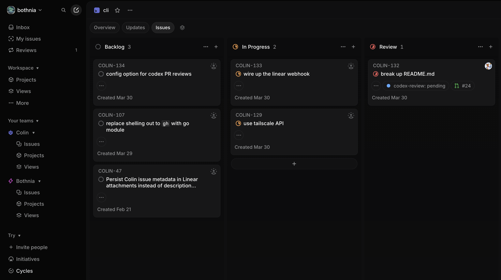

# Colin

Colin turns a Linear board into a managed delivery pipeline for coding work. Instead of manually driving one task at a time, you can keep many issues moving in parallel while Colin picks up ready work, hands implementation off to [Codex](https://platform.openai.com/docs/codex/overview), maintains a dedicated workspace for each issue, and pushes each task toward the next useful outcome.

The value is operational leverage: more tasks advancing at once, less branch and PR babysitting, and clearer handoffs for the moments where human judgment actually matters. Because Colin is driven through Linear state changes, you can manage the flow from the Linear app on your phone instead of being tied to a laptop session. Colin also works best with [Codex Code Review](https://help.openai.com/en/articles/11369540/) enabled on your GitHub repos so reviewable PRs get an additional automated pass before merge; OpenAI's setup instructions are [here](https://help.openai.com/en/articles/11369540/).

## Prerequisites

Before you run Colin, make sure you have:

- access to [Codex](https://platform.openai.com/docs/codex/overview) and a GitHub account or organization connected to it
- a GitHub token available to Colin via `repo.api_token`, `GITHUB_TOKEN`, or `GH_TOKEN` so publish and merge automation can talk to the GitHub API; `GITHUB_TOKEN` is the recommended env var, and when a token is configured Colin validates it during startup and workflow reload so broken credentials fail fast
- a Linear project and workflow with the states Colin uses for active work and handoffs

Optional but encouraged:

- [Codex Code Review](https://help.openai.com/en/articles/11369540/) enabled for the repositories where Colin will open pull requests, with `repo.codex_pr_reviews_enabled: true` set in `WORKFLOW.md` when you want Colin to wait for that review before merging
- public webhook ingress ready for Colin, typically via the Tailscale Funnel setup described in [OPERATIONS.md](OPERATIONS.md)

## What Using Colin Looks Like

Put work into `Todo`, let Colin pull it into `In Progress`, and let the board tell you what needs attention. Colin can keep multiple issues moving at the same time, route ready work to review, route unclear work to clarification, and finish merges once a PR is approved.



Colin actively works issues in these coding states:

- `Todo`
- `In Progress`

When Colin starts a `Todo` issue, it moves it to `In Progress`, keeps retrying while the issue remains active, and stops work if the issue leaves the active state set.

Colin uses these handoff states:

- `Review`: Colin prepares the branch and pull request for human review. Human action is required to review the PR and then move the issue either back to `Todo` for more work or forward to `Merge`.
- `Refine`: Colin stops for clarification because the issue is underspecified, capped, or has invalid metadata. Human action is required to improve the issue and move it back to `Todo`.
- `Merge`: Colin performs merge automation. Human action is only required if Colin sends the issue back to `Review` because of merge or review problems, or if no post-merge Linear automation target is configured.

Colin treats these as terminal states and stops work when an issue enters them:

- `Done`
- `Merged`
- `Closed`
- `Cancelled`
- `Canceled`
- `Duplicate`

## Operate Many Tasks At Once

Colin is built to supervise a queue, not a single foreground session. It keeps one workspace per issue, tracks retries and rate limits, and gives operators a live dashboard so they can monitor fleet-level progress instead of watching individual coding runs. Colin itself is also developed using Colin, so the workflow is exercised continuously in the project that builds it.


## How Colin Works

Colin runs as a long-lived orchestrator:

1. It watches the configured Linear project for issues in active states.
2. It creates or reuses a per-issue workspace so work can continue cleanly across retries and follow-up turns.
3. It advances ready issues toward the next handoff state: `Review`, `Refine`, or `Merge`.
4. It posts progress back to Linear and exposes a local dashboard for operators.

Watched-project Linear `Issue` `create` webhooks, plus watched-project `Issue` `update` webhooks that change scheduling-relevant fields such as `stateId`, can also trigger a best-effort immediate reconciliation between poll intervals so Colin does not always wait for the next scheduled poll to react.

## Getting Started

The fastest way to get Colin running is:

1. Export a valid `LINEAR_API_KEY` and `GITHUB_TOKEN` in your shell.
2. Run `colin config` or `go run . config` to generate `WORKFLOW.md`.
3. Start Colin with `colin` or `go run .`.
4. Optionally set up Tailscale and the watched-project Linear webhook if you want immediate refreshes between polling intervals.

If you are running from source, the explicit setup command is:

```bash
go run . config
```

If the selected workflow file is missing and Colin is running in an interactive terminal, Colin starts the same first-run setup automatically instead of failing immediately. This applies both to the default `WORKFLOW.md` and to custom paths passed with `--workflow`.

In an interactive terminal, `colin config` launches a Bubble Tea wizard that:

- collects the watched Linear project, repository URL, base branch, workspace root, port, and webhook preference
- validates token prefixes and required fields inline while you type
- fetches accessible Linear projects when `LINEAR_API_KEY` is available, while still allowing manual slug entry
- runs live preflight checks before writing `WORKFLOW.md`
- writes the workflow file without storing secrets in it


The setup wizard generates `WORKFLOW.md` and explains what still needs to be configured in the shell. It reads `LINEAR_API_KEY` and `GITHUB_TOKEN` from the current environment when available, and if either one is missing it can ask for a session-only value without writing that secret into `WORKFLOW.md`. Valid Linear keys must start with `lin_api_`, and GitHub tokens can be either fine-grained `github_pat_...` tokens or classic `ghp_...` tokens. In non-interactive contexts, Colin falls back to the line-oriented prompt flow so pipes and scripted tests still work.

### 1. Export the required secrets

Colin keeps secrets out of `WORKFLOW.md`. Export them in your shell before running setup or startup:

```bash
export LINEAR_API_KEY=lin_api_...
export GITHUB_TOKEN=github_pat_...
```

`GITHUB_TOKEN` is the recommended variable name, though Colin also accepts `GH_TOKEN`. Fine-grained `github_pat_...` tokens are preferred, but classic `ghp_...` PATs also work.

### 2. Generate or refresh `WORKFLOW.md`

Run `colin config` or `go run . config`. The wizard will guide you through:

- the Linear project Colin should watch
- the GitHub repository Colin should prepare branches and PRs for
- the base branch Colin should branch and merge from
- the workspace root Colin should use for per-issue worktrees
- the local dashboard port
- whether you want webhook follow-up guidance

At the review step Colin runs live checks when it has the required credentials:

- Linear config validation
- required Linear workflow states
- required managed Linear labels
- GitHub API access

Once the review passes, the wizard writes `WORKFLOW.md`.

Once the workflow file and `LINEAR_API_KEY` are available, Colin validates that the configured Linear states exist and ensures its managed labels exist before startup completes.

### 3. Create the GitHub token if you do not already have one

For the GitHub token itself, the fastest path is:

```bash
go run . setup github
```

That command prints a pre-filled GitHub fine-grained token link for the watched repo and the exact settings Colin expects:

- resource owner: the repo owner or org
- repository access: `Only select repositories`
- selected repository: the watched repo
- repository permissions: `Contents: Read and write` and `Pull requests: Read and write`
- export target: `GITHUB_TOKEN`

If fine-grained personal access tokens are blocked by org policy or approval flow, fall back to a classic personal access token with the `repo` scope. Classic tokens may also require `Configure SSO` after creation in orgs that use SAML SSO.

### 4. Start Colin

Start Colin with the checked-in or newly generated workflow:

```bash
go run .
```

If you prefer a built binary, build `./colin` and run that directly.

Useful flags:

- `go run . --verbose` restores the structured service log stream in the terminal.
- `go run . --workflow /path/to/WORKFLOW.md` points Colin at a different workflow file.
- `go run . --port 9999` overrides the dashboard port.
- `go run . config --workflow /path/to/WORKFLOW.md` generates or refreshes a workflow file at a custom path.

### 5. Optional: enable webhook-driven refreshes

If you opted into webhooks during setup, Colin will remind you that webhook exposure requires Tailscale. Before configuring webhooks, make sure public ingress is ready:

```bash
go run . setup tailscale
```

After public ingress is available, create or repair the watched project's Linear webhook:

```bash
go run . setup linear
```

Once that webhook is configured, Colin acknowledges `POST` requests to `/webhooks/linear`, verifies `Linear-Signature` when `tracker.webhook_signing_secret` is configured, and uses watched-project Linear `Issue` `create` deliveries plus watched-project `Issue` `update` deliveries with scheduling-relevant field changes to queue best-effort immediate reconciliation. The webhook never dispatches workers directly, and polling remains the fallback path if a webhook is delayed, dropped, or arrives before the orchestrator is ready to accept immediate refreshes.

Linear metadata attachments point at `server.ui_url` when configured. If that is unset but Tailscale Serve proxies Colin from `/`, Colin uses the preferred Tailscale Serve URL for metadata links, favoring HTTPS when available; otherwise it falls back to the local loopback dashboard URL.

## Further Reading

The root README stays intentionally short. For the full operational reference, use:
- [OPERATIONS.md](OPERATIONS.md) for setup details, workflow defaults, detailed Linear state handling, webhook readiness, and operational notes
- [WORKFLOW.md](WORKFLOW.md) for runtime configuration and the Codex prompt template
- [APP.md](APP.md) for repository architecture
- [SPEC.md](SPEC.md) for the local Symphony design reference
