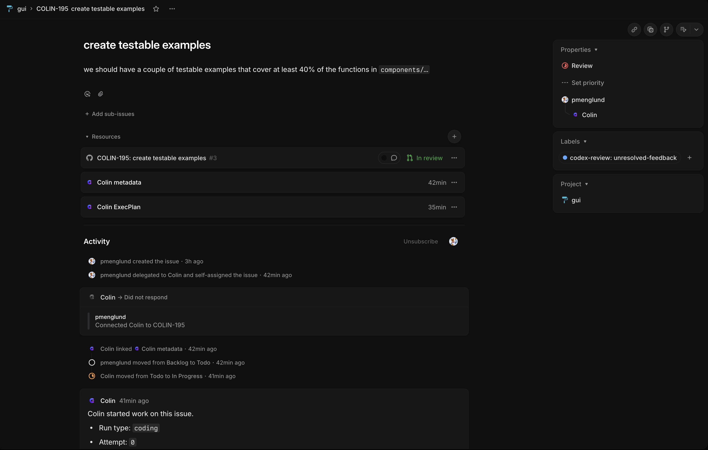

# Colin

Colin turns a Linear board into a managed delivery pipeline for coding work. Instead of manually driving one task at a time, you can keep many issues moving in parallel while Colin picks up ready work, hands implementation off to [Codex](https://platform.openai.com/docs/codex/overview), maintains a dedicated workspace for each issue, and pushes each task toward the next useful outcome. One Colin process can now supervise multiple Linear projects and multiple Git repositories from a single `WORKFLOW.md` when they share the same Linear and repository-host credentials.

The value is operational leverage: more tasks advancing at once, less branch and PR babysitting, and clearer handoffs for the moments where human judgment actually matters. Because Colin is driven through Linear state changes, you can manage the flow from the Linear app on your phone instead of being tied to a laptop session. Colin currently ships with a GitHub repository backend, and now routes repository-host setup and API access through a backend abstraction so GitLab or Gitea can be added later without rewriting all of setup and repo automation. Colin also works best with [Codex Code Review](https://help.openai.com/en/articles/11369540/) enabled on your GitHub repos so reviewable PRs get an additional automated pass before merge; OpenAI's setup instructions are [here](https://help.openai.com/en/articles/11369540/). When the optional `slack` workflow section is configured, Colin mirrors each tracked issue into one Slack message that shows the current state and next action while linking out to the full details, and the Slack app Home tab becomes a read-only list of watched issues that are outside `Backlog` and outside Colin's terminal states.

## Prerequisites

Before you run Colin, make sure you have:

- access to [Codex](https://platform.openai.com/docs/codex/overview) and a GitHub account or organization connected to it
- a repository backend token available to Colin via `repo.api_token`, `GITHUB_TOKEN`, or `GH_TOKEN` so publish and merge automation can talk to the configured backend API; today the only supported backend is GitHub, `GITHUB_TOKEN` is the recommended env var, and when a token is configured Colin validates it during startup and workflow reload so broken credentials fail fast
- a Linear project and workflow with the states Colin uses for active work and handoffs

If you want Colin to run as a first-class Linear app user, enable `tracker.app_mode: true` in `WORKFLOW.md`. You can either keep using a static `LINEAR_API_KEY` that belongs to the Linear app actor, or configure `tracker.oauth_client_id` and run `colin setup linear app --connect` so Colin stores the resulting app credentials in `.colin/auth.json`. In app mode Colin only starts new automation for issues that are delegated to the app.

Optional but encouraged:

- [Codex Code Review](https://help.openai.com/en/articles/11369540/) enabled for the repositories where Colin will open pull requests, with `repo.codex_pr_reviews_enabled: true` set in `WORKFLOW.md` when you want Colin to wait for that review before merging
- public webhook ingress ready for Colin, typically via the Tailscale Funnel setup described in [OPERATIONS.md](OPERATIONS.md), plus `LINEAR_WEBHOOK_SECRET` and `GITHUB_WEBHOOK_SECRET` exported when you enable signed provider webhooks; if the Linear app webhook uses its own secret, also export `LINEAR_APP_WEBHOOK_SECRET`
- a Slack bot token exported as `SLACK_BOT_TOKEN` and a channel ID in `WORKFLOW.md` when you want Colin to keep one issue-summary message per tracked issue in Slack; add `SLACK_APP_TOKEN` and `slack.app_token` when you also want Colin to acknowledge Slack button clicks over Socket Mode, and add `SLACK_SIGNING_SECRET` when you want Colin to serve the Slack app Home tab over the webhook server

## What Using Colin Looks Like

Put work into `Todo`, let Colin pull it into `In Progress`, and let the board tell you what needs attention. Colin can keep multiple issues moving at the same time, route ready work to review, route unclear work to clarification, and finish merges once a PR is approved.


Each Linear issue becomes the shared handoff record for the work. Colin links the pull request, metadata page, and stored ExecPlan as issue resources when they are available, then keeps posting progress in the same activity thread so reviewers can see what started, what changed, and why the issue is waiting in its current state.



Colin actively works issues in these coding states:

- `Todo`
- `In Progress`

When Colin starts a `Todo` issue, it moves it to `In Progress`, keeps retrying while the issue remains active, and stops work if the issue leaves the active state set. If `tracker.app_mode: true` is enabled, Colin only starts new `Todo`, `In Progress`, `Review`, or `Merge` automation for issues whose Linear `delegate` is the Colin app user; non-delegated issues in those states are ignored until they are delegated back. Delegating an issue to Colin also causes Colin to post a short acknowledgement in Linear that either says work will start from the current state or says which Colin-managed states the issue must move into first. When Linear created the delegation through an app agent session, Colin posts that first acknowledgement as a reply in the same Linear agent thread so the session no longer shows `Did not respond`; later progress updates still use Colin's normal issue progress thread. If a reviewed issue is moved from `Review` back to `Todo` on the same PR, Colin resumes work immediately, reuses the same persisted Codex thread for that issue when available, and reuses any review feedback or still-open review threads it can already see. Colin can also move a `Review` issue back to `Todo` automatically when a GitHub collaborator reacts with `+1` to an invited Codex PR review comment; in that case Colin scopes the follow-up to that reacted review thread, resolves it, and returns the issue to `Review`. For issues backed by a stored ExecPlan, Colin also keeps the ExecPlan's `## Progress` section up to date during implementation and will not hand the issue to `Review` until every listed task is complete.

Colin uses these handoff states:

- `Review`: Colin prepares the branch and pull request for human review. Human action is required to review the PR and then move the issue either back to `Todo` for more work on the same PR or forward to `Merge`. When Codex leaves a PR review comment that explicitly asks for 👍 or 👎 feedback, a GitHub collaborator can react with `+1` to have Colin move the issue back to `Todo`, address that specific review thread, resolve it, and return the issue to `Review`. ExecPlan-backed issues only reach `Review` after every task in the plan's `## Progress` section is checked off.
- `Refine`: Colin stops for clarification because the issue is underspecified, capped, or has invalid metadata. Human action is required to improve the issue and move it back to `Todo`. Colin also uses `Refine` when an ExecPlan-backed run cannot safely complete its remaining plan tasks or when the stored ExecPlan is invalid.
- `Merge`: Colin performs merge automation. Human action is only required if Colin sends the issue back to `Review` because of merge or review problems, or if no post-merge Linear automation target is configured.
  When GitHub briefly rejects the merge API with `Pull Request is not mergeable` even though a fresh PR read already reports the PR as mergeable, Colin refreshes the PR once and retries the merge automatically before handing the issue back to a human.
  When Colin has already repaired a merge conflict and GitHub still reports the PR as temporarily not mergeable, or when the base branch moves again immediately after that repair, Colin keeps the issue in `Merge`, waits a short interval, and retries automatically up to a bounded limit before handing the issue back to `Review`.
  When Codex reports a merge-conflict repair as ready, Colin now verifies that the branch head actually changed and that the repaired branch contains the expected base commit before attempting the merge retry. If that validation fails, Colin returns the issue to `Review` with evidence from the branch state instead of trusting the claimed repair.

By default Colin serializes `Merge` work even when other states run in parallel. That default reduces merge-conflict ping-pong on a moving base branch while still allowing `Todo`, `In Progress`, and `Review` work to use the wider global concurrency budget. If you want parallel merge automation anyway, override `agent.max_concurrent_agents_by_state.Merge` in `WORKFLOW.md`.

In legacy human-token workflows, Colin prefixes its Linear comments with `[colin]` so they are easy to spot. In Linear app mode, Colin omits that prefix because Linear already shows the app actor as the comment author. Colin keeps one Linear progress thread per issue and continues replying in that same thread across retries, review returns, and merge follow-up until the issue reaches `Refine` or a terminal state. When an issue returns from `Review` to `Todo`, Colin says whether it is still waiting for GitHub review threads to sync or whether more PR feedback still needs to be addressed. When the return was triggered by a detected `+1` reaction on an invited Codex PR review comment, Colin says that it is addressing only that reacted thread and leaves unrelated unresolved PR review threads alone. When an issue is in `Merge`, Colin says whether it is retrying automatically while Codex review is pending, or whether a human needs to resolve review feedback or a merge problem before moving the issue forward again.

When Slack support is enabled, Colin mirrors that same high-level workflow view into Slack in two places. Each tracked issue gets one Slack message that updates in place as the issue moves through the workflow. The message shows the issue state and next action directly, and links to Linear, the PR, Colin metadata, and the stored ExecPlan instead of inlining those details. The Slack app Home tab also shows a read-only list of watched issues that are still in flight, grouped by state, so operators can see the current queue without scanning a channel history.

Colin treats these as terminal states and stops work when an issue enters them:

- `Done`
- `Merged`
- `Closed`
- `Cancelled`
- `Canceled`
- `Duplicate`

## Operate Many Tasks At Once

Colin is built to supervise a queue, not a single foreground session. It keeps one workspace per issue, tracks retries and rate limits, and gives operators a live dashboard so they can monitor fleet-level progress instead of watching individual coding runs. The web UI now uses Server-Sent Events to learn when a newer snapshot exists, then refreshes the rendered HTML without waiting for a fixed polling interval. Dashboard `Codex output` panels lazy-load their current history when opened and then keep streaming only new entries at the top, which avoids re-fetch flicker while the surrounding dashboard keeps updating. Colin itself is also developed using Colin, so the workflow is exercised continuously in the project that builds it.

When Colin is running, it also starts a local [`gops`](https://github.com/google/gops) agent so you can inspect the live process with commands such as `gops`, `gops stack <pid>`, or `gops memstats <pid>` without changing Colin's normal startup or shutdown flow.


## How Colin Works

Colin runs as a long-lived orchestrator:

1. It watches the configured Linear project targets for issues in active states.
2. It creates or reuses a per-issue workspace so work can continue cleanly across retries and follow-up turns.
3. It routes each issue to the repository and base branch configured for that issue's target.
4. It advances ready issues toward the next handoff state: `Review`, `Refine`, or `Merge`.
5. It posts progress back to Linear and exposes a local dashboard for operators.

When a coding run finishes and Colin hands work off, the Linear issue comment is meant to be reviewable on its own. Colin now asks Codex to structure that handoff as `## Why`, `## Before`, `## After`, and `## Evidence`, and the default PR body mirrors those same sections. Colin still prefers Playwright screenshots for browser-visible work and terminal or TUI captures for terminal-visible work, with textual fallback because the Linear comment itself is text-only.

Those handoff comments also explain what Colin is doing next and what human action is required. That includes returned-review cases where GitHub review feedback has not synced yet, cases where review feedback still keeps the issue in `Todo`, and merge-conflict cases where Colin either repairs the branch automatically or sends the issue back to `Review` with concrete follow-up instructions.

When a coding run keeps coming back as "ready for review" but Colin still sees no reviewable repository diff, Colin now short-circuits that loop into `Refine` after a repeated no-diff diagnosis instead of burning the full turn budget. The resulting Linear handoff comment includes the likely cause plus direct links to the Colin metadata page and Slack thread when those are available, so operators can inspect the captured Codex output and workspace history quickly.

Watched-project Linear `Issue` `create` webhooks, watched-project `Issue` `update` webhooks that change scheduling-relevant fields such as `stateId`, and watched-team Linear `IssueLabel` create or remove webhooks can also trigger a best-effort immediate reconciliation between poll intervals so Colin does not always wait for the next scheduled poll to react, including when a human removes the `paused` label. GitHub does not emit a repository webhook for PR review-comment reactions, so Colin detects collaborator `+1` approvals on invited Codex PR review comments during its normal polling loop instead.

## Getting Started

The fastest way to get Colin running is:

Run these commands from the root of the git repository Colin should manage so `WORKFLOW.md` and any git-derived defaults apply to the correct checkout.

1. Export a valid `GITHUB_TOKEN` in your shell. For Linear, either export `LINEAR_API_KEY` or configure app-mode OAuth as described below.
2. Run `colin config` to generate `WORKFLOW.md`.
3. Start Colin with `colin`.
4. Optionally set up Tailscale plus the watched-project Linear and GitHub webhooks if you want immediate refreshes between polling intervals.

The workflow-authoring command is:

```bash
colin config
```

By default Colin uses `WORKFLOW.md`. Set `COLIN_WORKFLOW=/path/to/workflow.md` when you want a shell-level default, and use `--workflow` when you need a one-off override.

If the selected workflow file is missing and Colin is running in an interactive terminal, Colin starts the same first-run setup automatically instead of failing immediately. This applies to the default `WORKFLOW.md`, to paths from `COLIN_WORKFLOW`, and to custom paths passed with `--workflow`.

In an interactive terminal, `colin config` launches a Bubble Tea wizard that:

- collects the watched Linear project, repository URL, base branch, workspace root, port, and webhook preference
- validates token prefixes and required fields inline while you type
- fetches accessible Linear projects when `LINEAR_API_KEY` is available, while still allowing manual slug entry
- runs live preflight checks before writing `WORKFLOW.md`
- writes the workflow file without storing secrets in it


The setup wizard generates `WORKFLOW.md` and explains what still needs to be configured in the shell. It reads `LINEAR_API_KEY` and `GITHUB_TOKEN` from the current environment when available, and if either one is missing it can ask for a session-only value without writing that secret into `WORKFLOW.md`. New workflows write `repo.backend: github` explicitly so the repository backend is no longer implicit. Valid Linear keys must start with `lin_api_`, and GitHub tokens can be either fine-grained `github_pat_...` tokens or classic `ghp_...` tokens. The wizard does not enable Linear app mode automatically; when you want Colin to act as its own Linear app user, add `tracker.app_mode: true` to `WORKFLOW.md`, set `tracker.oauth_client_id` or export `LINEAR_OAUTH_CLIENT_ID`, and then verify the OAuth and webhook settings with `colin setup linear app`. In non-interactive contexts, Colin falls back to the line-oriented prompt flow so pipes and scripted tests still work.

### 1. Export the required secrets

Colin keeps secrets out of `WORKFLOW.md`. Export them in your shell before running setup or startup:

```bash
export LINEAR_API_KEY=lin_api_...
export LINEAR_OAUTH_CLIENT_ID=lin_oauth_client_...
export GITHUB_TOKEN=github_pat_...
export LINEAR_WEBHOOK_SECRET=...
export LINEAR_APP_WEBHOOK_SECRET=...
export GITHUB_WEBHOOK_SECRET=...
export SLACK_BOT_TOKEN=xoxb-...
export SLACK_APP_TOKEN=xapp-...
export SLACK_SIGNING_SECRET=...
```

`GITHUB_TOKEN` is the recommended variable name, though Colin also accepts `GH_TOKEN`. Fine-grained `github_pat_...` tokens are preferred, but classic `ghp_...` PATs also work.

If `tracker.app_mode: true` is enabled, Colin must resolve Linear app credentials rather than a normal user token. You can provide those credentials either through `LINEAR_API_KEY` or through `.colin/auth.json` populated by `colin setup linear app --connect`. Colin validates that at startup and fails fast if the resolved actor still belongs to a normal user.

If you enable the optional `slack` section in `WORKFLOW.md`, Colin requires `slack.bot_token`, `slack.app_token`, and `slack.channel_id` for issue summaries plus interactive buttons. Export both `SLACK_BOT_TOKEN` and `SLACK_APP_TOKEN`, enable Socket Mode for the Slack app, and keep interactivity enabled so Slack button clicks can be acknowledged without a public Slack interactivity URL. If you also want Colin to publish the Slack app Home tab through the webhook server, export `SLACK_SIGNING_SECRET` so Colin can verify inbound Slack webhook requests.

### 2. Generate or refresh `WORKFLOW.md`

Run `colin config` when you need to create or refresh `WORKFLOW.md`. The wizard will guide you through:

- the default Linear project Colin should watch
- the default repository Colin should prepare branches and PRs for
- the default base branch Colin should branch and merge from
- the workspace root Colin should use for per-issue worktrees
- the local dashboard port
- whether you want webhook follow-up guidance

At the review step Colin runs live checks when it has the required credentials:

- Linear config validation
- required Linear workflow states
- required managed Linear labels
- repository backend API access

Once the review passes, the wizard writes `WORKFLOW.md`.

For multi-target workflows, keep shared credentials and shared state lists at the top level, then add a `targets:` list where each item provides `project_slug`, `repo_url`, and `base_ref`. The interactive setup flow still writes a single-target workflow today, so multi-target workflows are edited directly in `WORKFLOW.md`.

To enable app mode after the wizard runs, edit `WORKFLOW.md` and set:

```yaml
tracker:
  app_mode: true
  oauth_client_id: $LINEAR_OAUTH_CLIENT_ID
```

Then run `colin setup linear app --connect` to serve the tailnet-only `/setup/linear/app` and `/callbacks/linear` routes long enough to complete Linear OAuth into `.colin/auth.json`. After that, rerun `colin setup linear app` to confirm the stored auth resolves to the expected app actor before you start Colin.

If the Linear app webhook uses a different signing secret than the watched project webhook, also add:

```yaml
tracker:
  app_webhook_signing_secret: $LINEAR_APP_WEBHOOK_SECRET
```

Once the workflow file and either `LINEAR_API_KEY` or `.colin/auth.json` are available, Colin validates that the configured Linear states exist and ensures its managed labels exist before startup completes. When `tracker.app_mode: true` is enabled, Colin also validates that the resolved credentials map to a Linear app actor instead of a normal user.

### 3. Create the repository backend token if you do not already have one

For the current GitHub backend, the fastest path is:

```bash
colin setup repo
```

That command dispatches through the configured repository backend. Today it prints a pre-filled GitHub fine-grained token link for the watched repo and the exact settings Colin expects:

- resource owner: the repo owner or org
- repository access: `Only select repositories`
- selected repository: the watched repo
- repository permissions: `Contents: Read and write` and `Pull requests: Read and write`
- export target: `GITHUB_TOKEN`

If fine-grained personal access tokens are blocked by org policy or approval flow, fall back to a classic personal access token with the `repo` scope. Classic tokens may also require `Configure SSO` after creation in orgs that use SAML SSO.

### 4. Start Colin

Start Colin with the checked-in or newly generated workflow:

```bash
colin
```

In an interactive terminal, `colin` opens a Bubble Tea runtime dashboard by default. The overview shows the local and public URLs Colin is serving plus the current workers and their state. Press `l` to switch to the buffered log view, use the arrow keys or page keys to scroll, and press `q` to begin a shutdown drain. Once shutdown begins, Colin stops starting new work, shows a shutdown indicator in both dashboards, and waits for active workers to go idle; press `q` again or `esc` to exit immediately.

These docs assume `colin` is installed on your `PATH`.

Useful flags:

- `colin --verbose` restores the structured service log stream in the terminal.
- `COLIN_WORKFLOW=/path/to/WORKFLOW.md colin` sets the default workflow file for the current shell.
- `colin --workflow /path/to/WORKFLOW.md` points Colin at a different workflow file.
- `colin --port 9999` overrides the dashboard port.
- `colin --workflow /path/to/WORKFLOW.md config` generates or refreshes a workflow file at a custom path.

When you want to reopen a Colin-managed Codex thread locally, run:

```bash
colin resume <thread-id>
colin resume <issue-id>
```

Colin resolves either the persisted Codex thread id directly or the owning Linear issue through stored Colin metadata, prepares that issue's workspace locally, and then launches `codex resume` there. That means `colin resume COLIN-123` works without first looking up the thread id on the issue. Interactive launches use `codex.cli_command`, which defaults to `codex`; the existing `codex.command` setting remains the app-server command Colin uses for autonomous runs.

### 4a. Optional: inspect Slack setup

If you want Colin to mirror tracked issues into Slack, use:

```bash
colin setup slack
```

That command inspects the workflow's `slack` section, reports whether `slack.bot_token`, `slack.app_token`, and `slack.channel_id` are declared and resolved, and reminds you to enable Socket Mode and Interactivity for the Slack app before startup.

### 5. Optional: enable webhook-driven refreshes

If you opted into webhooks during setup, Colin will remind you that webhook exposure requires Tailscale. Before configuring webhooks, make sure public ingress is ready:

```bash
colin setup tailscale
```

After public ingress is available, use `colin setup ...` to prepare the external integrations referenced by `WORKFLOW.md`, such as the watched project's Linear webhook and the watched repository's GitHub webhook settings:

```bash
colin setup linear webhook
colin setup linear app
colin setup github webhook
```

Once those webhooks are configured, Colin acknowledges `POST` requests to `/webhooks/linear` and `/webhooks/github`, verifies `Linear-Signature` against `tracker.webhook_signing_secret` for the watched project webhook and `tracker.app_webhook_signing_secret` for the Linear app webhook when those secrets are configured, verifies `X-Hub-Signature-256` when `repo.webhook_signing_secret` is configured, and uses relevant watched-project Linear issue deliveries, watched-team Linear issue-label deliveries, relevant `AgentSessionEvent` deliveries for the Colin app, plus relevant watched-repository GitHub pull-request review deliveries to queue best-effort immediate reconciliation. GitHub does not expose a repository webhook for PR review-comment reactions, so collaborator `+1` approvals on invited Codex PR review comments are detected during Colin's normal poll loop instead, which can then move a `Review` issue back to `Todo` for a scoped follow-up on that single thread. The webhook never dispatches workers directly, and polling remains the fallback path if a webhook is delayed, dropped, or arrives before the orchestrator is ready to accept immediate refreshes.

`colin setup linear app` prints the current self-hosted Linear app sketch for this workflow: it resolves the current auth source, shows whether `tracker.app_mode` is enabled, reports the current actor name and type, prints the tailnet-only OAuth connect and callback URLs, points the app at the same `/webhooks/linear` endpoint, subscribes the app to `AgentSessionEvent`, requests the OAuth scopes `read`, `write`, and `app:assignable` so the app can appear in Linear's assignment menu, reminds you to keep the existing issue-webhook wake-up path enabled, and points you at `tracker.app_webhook_signing_secret` when the app webhook uses its own secret. Running `colin setup linear app --connect` starts a temporary local server on `server.port` so Tailscale Serve can expose `/setup/linear/app` and `/callbacks/linear` while you complete OAuth. The answer to "should it disable the webhook?" is no. App-triggered sessions should be additive to Colin's current poll-plus-webhook scheduling, not a replacement for it.

`server.port` controls the local Colin UI and the temporary tailnet-only OAuth callback server started by `colin setup linear app --connect`. When webhook setup is enabled, `colin config` also writes `server.webhook_port`, which defaults to `8998`, so Tailscale Serve can proxy the UI while Tailscale Funnel proxies `/webhooks` on a separate public HTTPS port such as `8443`.

Linear metadata attachments point at `server.ui_url` when configured. If that is unset but Tailscale Serve proxies Colin from `/`, Colin uses the preferred Tailscale Serve URL for metadata links, favoring HTTPS when available; otherwise it falls back to the local loopback dashboard URL.

## Releasing

Colin releases are built with GoReleaser and published from GitHub Actions when you push a version tag that starts with `v`, for example `v0.1.0`.

To validate the release packaging locally without publishing anything, run:

```bash
task release-check
task release-snapshot
```

That writes release archives and `checksums.txt` into `dist/`.

To cut a real release after the release workflow is present on the default branch, create and push an annotated tag:

```bash
git tag -a v0.1.0 -m "v0.1.0"
git push origin v0.1.0
```

GitHub Actions should then run the `release` workflow and publish a GitHub Release for that tag with downloadable archives and checksums. For the manual repository settings this workflow depends on, see [OPERATIONS.md](OPERATIONS.md).

## Further Reading

The root README stays intentionally short. For the full operational reference, use:
- [OPERATIONS.md](OPERATIONS.md) for setup details, workflow defaults, detailed Linear state handling, webhook readiness, and operational notes
- [WORKFLOW.md](WORKFLOW.md) for runtime configuration and the Codex prompt template
- [APP.md](APP.md) for repository architecture
- [SPEC.md](SPEC.md) for the local Symphony design reference
