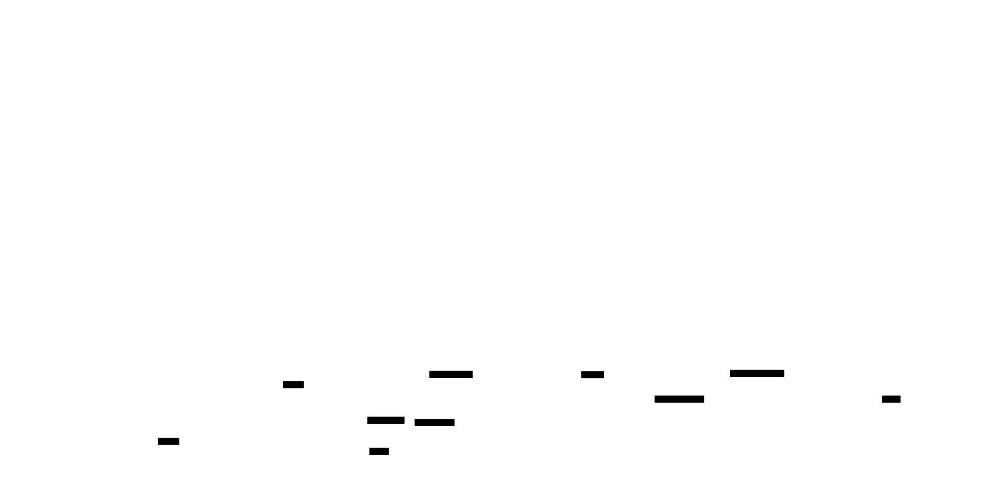

# Colin Linear State Audit And Proposed State Machine

This document has two jobs. First, it audits the Linear states Colin uses today and explains where the current behavior does not map cleanly to a strict state machine. Second, it proposes a cleaner state model for a later implementation change. The proposal in this document is not fully live in the current codebase.

The current runtime behavior is split across configuration, orchestration, and documentation. The main coupling points are `WORKFLOW.md`, `internal/config/config.go`, `internal/automation/runner.go`, `internal/tracker/linear/client.go`, `internal/service/preflight.go`, `README.md`, `APP.md`, `OPERATIONS.md`, and `internal/ui/render.go`.

## Current Runtime Model

In this repository, a strict state machine would mean that each Linear state has one primary meaning, a clear owner for the next action, and a finite set of allowed transitions. Colin does not fully satisfy that bar today. Some meanings are encoded in Linear states, some in labels, some in timeline history, and some in runner-side rules.

### Configured state buckets

The checked-in `WORKFLOW.md` currently defines these buckets:

- Active coding states: `Todo`, `In Progress`
- Publish handoff states: `Review`
- Merge handoff states: `Merge`
- Terminal states: `Done`, `Merged`, `Closed`, `Cancelled`, `Canceled`, `Duplicate`

Those buckets are loaded by `internal/config/config.go`. Colin polls the union of active, publish, and merge states as candidate states. Startup validation in `internal/service/preflight.go` and `internal/tracker/linear/client.go` checks that the named Linear states exist in the watched project.

### `Todo`

`Todo` means more than one thing today. It is the initial ready-to-code state, but it is also the return state after review. `internal/automation/runner.go` treats `Todo` as part of `tracker.active_states`, so the issue is eligible for coding work. Before the coding run starts, `moveActiveIssueToWorkingState` advances `Todo` to `In Progress`.

`Todo` also carries special rules that are not obvious from the state name alone. In `OPERATIONS.md`, returned-review issues can remain in `Todo` while Colin waits for GitHub review threads to appear. The `paused` label can also block dispatch while the issue still says `Todo`.

Owner of the next action: usually Colin, unless a blocker, the `paused` label, or review-thread synchronization is holding the issue.

### `In Progress`

`In Progress` is the active working state Colin uses while Codex is coding. It is also just the second configured active state, so part of its meaning comes from its position in the ordered `tracker.active_states` list rather than from a first-class workflow model.

While the issue remains in `In Progress`, Colin can continue multi-turn coding, retry after failures, or stop when the issue leaves the active state set. If a coding run succeeds with reviewable changes, `moveSuccessfulCodingRunToHandoffState` moves the issue to the first configured publish state, which is currently `Review`.

Owner of the next action: Colin, until it hands off or the issue leaves the active set.

### `Refine`

`Refine` is a real runtime state even though it is not part of the configured active, publish, merge, or terminal buckets in `WORKFLOW.md`. `internal/automation/runner.go` hard-codes `Refine` with `refineStateName = "Refine"`.

Colin uses `Refine` for at least three distinct cases:

- the issue is too underspecified to implement safely
- the coding run hit the maximum turn count without producing reviewable output
- the issue metadata is invalid, for example duplicate Colin ExecPlan attachments

All three cases need human intervention, but they are not the same problem. That makes `Refine` a catch-all clarification or recovery state rather than a clean single-purpose state.

Owner of the next action: human.

### `Review`

`Review` is the configured publish handoff state. When an issue reaches `Review`, Colin stops coding and performs publish automation such as commit, push, and pull-request creation or reuse. Human review is then expected.

The meaning is cleaner than some other states, but it still has a few edge behaviors around returned review cycles. When an issue moves from `Review` back to `Todo`, Colin looks at the most recent `Review -> Todo` timeline window, collects human comments, and may also poll GitHub for unresolved review threads before resuming coding.

Owner of the next action: first Colin for publish automation, then human review.

### `Merge`

`Merge` is the configured merge handoff state, but it currently carries several meanings:

- the PR is approved and ready for merge automation
- Colin is actively attempting the merge
- Colin is waiting for Codex PR review pickup or approval
- Colin is retrying around merge conflicts or merge prerequisites

`internal/automation/runner.go` and `OPERATIONS.md` show that the issue can remain in `Merge` while Colin waits for review signals, checks unresolved Codex review threads, performs merge recovery, or retries merge execution. In other words, `Merge` means both readiness and active processing.

Owner of the next action: ambiguous. Sometimes human, sometimes Colin, sometimes “nobody right now, Colin is waiting”.

### `Merged`

`Merged` is currently treated as a terminal state. It also appears as the watched team’s post-merge git automation target in current documentation. `internal/automation/runner.go` calls `applyPostMergeState` after merge completion, so the issue may be moved into the team’s configured post-merge Linear state automatically.

`Merged` is the cleanest candidate for Colin’s final terminal state because it has one obvious meaning: the code landed and Colin’s managed workflow is complete.

Owner of the next action: no one inside Colin’s managed loop.

### Other terminal states

`Done`, `Closed`, `Cancelled`, `Canceled`, and `Duplicate` are all terminal from Colin’s point of view. Colin stops work if the issue enters one of them. These states are business or bookkeeping exits rather than active parts of Colin’s coding pipeline.

`Done` is slightly awkward next to `Merged` because both can look like “finished” states, but only one of them corresponds directly to the repository change landing.

Owner of the next action: no one inside Colin’s managed loop.

### Non-state signals that also shape behavior

The current workflow cannot be understood from Linear states alone. These side signals also matter:

- The `paused` label blocks dispatch even if the issue is in an active state.
- Returned-review timeline history determines which human feedback is injected into the next prompt.
- GitHub review-thread synchronization can hold a returned-review issue in `Todo`.
- Managed Codex review labels describe pending, approved, or unresolved PR-review status without changing the main Linear state.
- The dashboard in `internal/ui/render.go` presents a fixed set of state columns, which makes the pipeline look more canonical than it really is.

## Where The Current Model Is Not Strict

The current model is workable, but it is not a strict state machine.

`Todo` mixes at least two unrelated meanings: “brand new work ready to start” and “returned from review and possibly waiting for review feedback to sync”. Those are not the same operational situation.

`Refine` mixes clarification, capped runs, and invalid metadata. All of those require human action, but they are different failure reasons and should not have to share one state name if the goal is semantic clarity.

`Merge` mixes readiness, waiting, active automation, and retry behavior. A human looking only at Linear cannot reliably tell whether Colin still needs approval, is actively merging, or is blocked on a recoverable merge problem.

The configured `active_states` list is also overloaded. In `internal/automation/runner.go`, it is both a set of coding-eligible states and an ordered progression. That means the list is doing workflow-transition work as well as eligibility work.

Finally, terminal states are not cleanly separated by meaning. `Merged` is repository-specific completion, while `Done` can mean broader product completion. Colin currently treats both as terminal without clearly distinguishing their roles in the workflow narrative.

## Proposed Canonical State Machine

The cleaner model below is a proposal for a later implementation issue. It aims for one primary meaning per state, a clear owner of the next action, and explicit transitions.

### Proposed states

#### `Backlog`

The issue is parked outside Colin’s managed loop. Colin does not dispatch from here.

Owner of the next action: human.

#### `Todo`

The issue is ready for Colin to begin or resume coding as soon as normal dispatch gates pass. It should not also mean “waiting for review-thread sync”; that waiting condition should be exposed as status text or metadata instead.

Owner of the next action: Colin.

#### `In Progress`

Colin is actively coding, retrying coding, or continuing a coding session.

Owner of the next action: Colin.

#### `Needs Clarification`

Human clarification is required before Colin can continue. This replaces the current overloaded `Refine` name with a more explicit meaning. If the team prefers to keep the Linear state name `Refine`, the semantics should still narrow to clarification only.

Owner of the next action: human.

#### `Review`

A pull request exists and the next required action is human review. Returned-review work should move back to `Todo` once it is truly ready for Colin to code again.

Owner of the next action: human.

#### `Ready to Merge`

Human review is complete and the issue is cleared for merge automation. This separates “approved and ready” from “actively merging”.

Owner of the next action: Colin.

#### `Merging`

Colin is actively executing merge automation, including merge checks and automatic conflict repair. If human action becomes necessary, the issue should leave `Merging` instead of staying there as a hidden waiting room.

Owner of the next action: Colin.

#### `Merged`

The change landed and Colin’s managed lifecycle is complete.

Owner of the next action: no one inside Colin’s managed loop.

### Proposed transitions

The proposed finite transition set is:

- `Backlog -> Todo`
- `Todo -> In Progress`
- `In Progress -> Needs Clarification`
- `Needs Clarification -> Todo`
- `In Progress -> Review`
- `Review -> Todo`
- `Review -> Ready to Merge`
- `Ready to Merge -> Merging`
- `Merging -> Merged`
- `Merging -> Review` when merge repair or review gating requires human action

Human override exits such as `Canceled`, `Cancelled`, `Closed`, `Duplicate`, or `Done` can still happen from any non-terminal state, but they should be described as explicit override exits rather than normal pipeline transitions.

### What should not be a Linear state

These should remain labels, metadata, comments, or dashboard status rather than first-class Linear states:

- paused or unpaused dispatch status
- waiting for returned-review GitHub threads to sync
- waiting for Codex PR review pickup
- waiting for Codex PR review approval
- max-turn exhaustion details
- duplicate ExecPlan attachment conflicts

Those are useful operational signals, but they are not stable workflow positions.

## Why This Proposal Is Cleaner

The proposal narrows each state to one main meaning and gives each state a clear answer to “who acts next?”.

`Todo` becomes purely ready-for-coding. `Review` becomes purely ready-for-human-review. `Ready to Merge` becomes purely approved-and-ready. `Merging` becomes purely active merge automation. `Merged` becomes purely landed. Clarification is also separated from metadata-recovery and other runner-side reasons.

This design also removes the need to treat `active_states` as both a set and an ordered workflow. Eligibility and transition logic can be modeled separately.

## Follow-Up Implementation Notes

If the proposed model is accepted, a later implementation issue will need to update at least these areas:

- `WORKFLOW.md` and workflow bootstrapping defaults
- `internal/config/config.go`
- `internal/automation/runner.go`
- `internal/tracker/linear/client.go`
- `internal/service/preflight.go`
- `internal/ui/render.go`
- `README.md`, `APP.md`, and `OPERATIONS.md`

That follow-up should be treated as a real runtime migration, not as a documentation-only change.

## Diagram Source

The proposed state machine is captured in `docs/linear-state-machine.d2`. The rendered SVG companion file is `docs/linear-state-machine.svg`.

